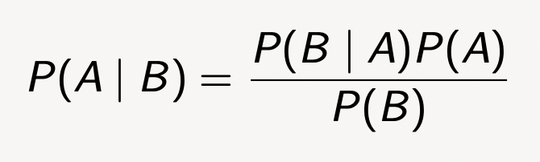
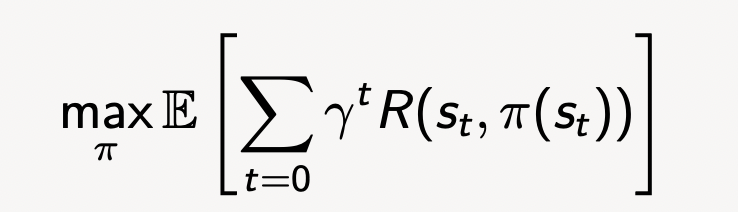

#Module 3: Reasoning and Planning Under Uncertainty

---

#### Causes of Uncertainty: System Noise and Errors

Uncertainty is caused by the following:
- Control error or disturbance from external forces
    - Effect of performing action = non-deterministic
- Errors in sensing and processing
    - Imperfect world observation (partial observability)
- Strategic uncertainty and interaction with other agents AKA game theory

#### Where do the modelling errors come from?

- Real models are often too complex to model
  - Lazy, eg rolling a dice in casino (wind dir, people around, etc)
- Deliberate, to reduce computational complexity. Eliminate irrelevant details
- Accidental
- Abstraction

#### Abstraction Error to Modelling Error
Actual possible states often too large

Solvable by current computing power:
- Clustering actual and assume all states in cluster are the same
- **Meaning:** A state in model corresponds to a set of states in the actual world not differentiatable by program
- Simarly with action space

In both, effect of performing action is non-deterministic

Usually deal with bounded, quantifiable uncertainty

#### Environment Assumptions

- Does the agent know the state of the world/itself exactly?
**Fully observable** vs partially observable
- Does an action map one state into a single other state?
Deterministic vs **non-deterministic**
- Can the world change while the agent is “thinking”?
**Static** vs **dynamic**
- Are the actions and percepts discrete?
**Discrete** vs **continuous**
---

### Review of Probability

>#### Terminology
 

**Experiment**: Occurrence with uncertain outcome that we can observe

**Sample space**: Set of all possible outcomes of an experiment

**Event**: Subset of sample space

**Outcome**: Particular result of an experiment

**Probability**: Function that maps events to real numbers

 
 

#### Probability Distribution
 

**Random Variable** (X) has an element of chance associated

Value of any function of a random variable is also a random variable

>#### Probability Mass Function (PMF)
For discrete variables, a pmf, P(X=X) describes the probability of each value of X
- For finite discrete-valued variables, finite vector of non negative numbers that sum to 1
- For infinite discrete-valued variables, series of numbers tover infiintie set of distinct elements

>#### Probability Density Function (PDF)
For continuous variables, a probability density function (pdf), f (x), is a continuous function
that integrates from below to the cumulative density function:

###### Discrete Example : 6-sided die

###### Continuous Example : Height Measurement

> #### Conditional Probability and Indpendence

 **Conditional Probaility** is a measure of the probability of an event given that another event has occurred

 
If the event of interest is A and the event B is known to have occurred, then the corresponding conditional probability of A given B is denoted P(A | B). 
 

If two events, A and B, are independent, then the probability of both occurring is
**P(A ∩ B) = P(A) P(B)**

 

Otherwise, if the events are dependent:
**P(A ∩ B) = P(B) P(A | B) = P(A) P(B | A)**
 

In both cases, the probability of events A or B occurring is:
**P(A ∪ B) = P(A) + P(B) − P(B ∩ A)**
 

Q: When can we assume that P(A ∪ B) = P(A) + P(B)?
- When its mutually exclusive

 

> #### Bayes Rule
> 
> Bayes rule rearranges the conditional probability formula to allow us to calculate the probability of an event given the probability of another event.

##### **Key Idea:** knowing symptoms of a disease is easier than figuring out the disease given the symptoms.

---

### Search Under Uncertainty: AND-OR  Trees

#### Making Decisions
- Find a plan that works regardless of outcomes 
- No longer rely on sequence of actions
- Need a *conditional* plan. The action to perform depends on previous action output
  - Need a different type of tree data structure

#### AND-OR Trees
- A tree with interleaving OR and AND levels
- At each node of an OR level, branching is introduced by agent choice
- At each node of an AND level, branching is introduced by environment

##### Exammple : Slippery Vacuum Robot

States: Conjunction of the following State Factors
- Robot Position: {In  $R_1$, in $R_2$}
- $R_1$ state: {clean, dirty}
- $R_2$ state: {clean, dirty}

Action: {move left, move right, suck($R_1$), suck($R_2$)}

World Dynamics: **non-deterministic** after performing an action at a state, the robot may end up in one of several possible state 

**Initial state:**
• (Robot in $R_1$) ∧ ($R_1$ is clean) ∧ ($R_2$ is dirty)

**Goal state:**
• ($R_1$ is clean) ∧ ($R_2$ is clean)

Solution is a **sub tree** that:
- a goal node
- specifies one action at OR level 
- includes every possible outcome at AND level

> A leaf state node is either a goal or a closed node

> If an action state extends to a node that is closed, then the action is not possible

> Keep labelling until root
>
> Problem is ***solved*** when root node solved
> 
> Problem ***not** **solved*** when root node closed
> 
> 
> 

The <b> solution </b> is the sub-tree that establishes root is solved

Defines a <b> conditional plan  </b>(or contingency plan) that includes tests on sensory data to pick next action

#### Decision-theoretic Planning

Agent needs to make a sequence of decisions regarding action, depending on the state of the world

Agents carry out actions:
- forever **infinite horizon**
- until some stopping condition **finite horizon**
- finite and fixed number of actions **fixed horizon**

What should an agent do when:
- it gets rewards (and penalties) and tries to maximize its rewards received
- actions can be stochastic; the outcome of an action can’t be fully predicted
- there is a model that specifies the (probabilistic) outcome of actions and the rewards
- the world is fully observable?

##### Initial Assumptions 
• flat or modular or hierarchical
• explicit states or features or individuals and relations
• static or finite stage or indefinite stage or infinite stage
• fully observable or partially observable
• deterministic or stochastic dynamics
• goals or complex preferences
• single agent or multiple agents
• knowledge is given or knowledge is learned
• perfect rationality or bounded rationality
***
#### Markov Decision Processes (MDPs)
##### Markov Chains

- Markov chains have a set of states, and at each step they transitionn to a state (either a new state or the same state) according to some transition probabilities
- **Markov propoerty** Prob distribution for next state depends only on current state
- Probabilities of outgoing arrows from a state sum to 1

> Can write the transition probabilities as a stochastic matrix
 

- A **Markov decision process** augments a Markov chain with actions and values:
  

##### World State 
- World state is info S.T if the agent knew world state,no info aobut past is relevant to future. ***Markovian Assumption***

- $S_t$ is the state at time t and $A_t$ is the action at time *t*:
  

  $P(s'|s,a)$ is the probability of transitioning to state $s'$ given that the agent is in state $s$ and takes action $a$.

    - The state captures all relevant information from history
    - The state is a sufficient stat of the future
- The dynamics are **stationary** if the distribution is the same for each time point

#### Markov Decision Processes
A framework to find the best sequence of actions to perform when the outcome of each action is non-deterministic.

>Examples:
>- Games: chess, backgammon, etc.
>- Cycling race, car race, etc.
>- Navigation :

An MDP consists of: 
- set $S$ of **states**
- set $A$ of **actions**
 
- $P(S_{t+1}|S_t,A_t)$ is the **transition function** that specifies the probability of transitioning to state $S_{t+1}$ given that the agent is in state $S_t$ and takes action $A_t$. Can denote as $P(s'|s,a)$
- $R(S_t,A_t)$ is the **reward function** that specifies the reward received by the agent for taking action $A_t$ in state $S_t$. 
  - Can denote as $R(s,a, s')$, whic his the reward for being in state $s$, performing action $a$ and ending up in state $s'$
- Sometimes we use the expected reward for being in s and doing $a$, which is $R(s,a) = \sum_{s'} P(s'|s,a)R(s,a,s')

- $\gamma$ is **discount factor**
- An MDP's **objective** is 

##### Example MDP Definition : to exercise or not to exercise

##### Example MDP Definition : Simple Grid World

- **States**: 100 states corresponding to position of robot
- **Actions** up, down, left, right
- **Transition** Robot goes in the commanded direction with probability 0.7, and one of the
other directions with probability 0.1.
- **Rewards** If it crashes into an outside wall, it remains in its current position and has a
reward of −1
- Four special rewarding states; the agent gets the reward when leaving

##### Planing Horizons
The planning horizon is how far ahead the planner looks to make a decision
- The robot gets flung to one of the corners at random after leaving a positive (+10 or +3) reward state 
  - process never stop
  - infinite horizon
- The robot gets +10 or +3 in the state, then it stays there getting no reward. Or it is left
with only a special action exit, and the episode ends. These are absorbing states
- indefinite horizon
- robot will eventually reach an absorbing state b/c of the random nature of the environment

##### Information Availabliity
What info is available when the agent decides hwat to do?
- **fully-obersable MDP** the agent gets to observe $S_t$ before deciding on $A_t$
- **partially-observable MDP (POMDP)** the agent has some noiser sensor of the state. It is a mix of a hidden Markov model and an MDP. It needs to remember (smoe function of) its sensing and acting history.
  
> only doing fully observable MDP in COMP3702

##### Policy

- A **policy** is a sequence of actions, taken to move from each state to the next state over the whole time horizon
- A **stationary policy** is a function or a map:
 

given a state $s$, $\pi(s)$ specifies what action the agent who is following $\pi$ will do.
- A **optimal policy** usually denotes as $\pi *$ is one with maixmum expected discounted reward
- 
  
>***For a fully-observable MDP*** with stationary dynamics and rewards with infinite or indefinite horizon, there is always an optimal stationary policy

#### Solution to an MDP

#### Value of a Policy

---
#### Week 7
##### September 5

Pretty much, A2 gets released tomorrow. A2 algorithsm are based on Value Iteration (this week tut) and Polciy Iteration (next week tut). The environment for this is DragonGame on A1 with adjusted probabilities, moves etc. 

 

### (Refresher) An MDP consists of:
- set $S$ of **states**
- set $A$ of **actions**
- $P(S_{t+1}|S_t,A_t)$ is the **transition function** that specifies the probability of transitioning to state $S_{t+1}$ given that the agent is in state $S_t$ and takes action $A_t$. Can denote as $P(s'|s,a)$
- $R(S_t,A_t)$ is the **reward function** that specifies the reward received by the agent for taking action $A_t$ in state $S_t$ at time $t$. 
  - Can denote as $R(s,a, s')$, whic his the reward for being in state $s$, performing action $a$ and ending up in state $s'$
  - Sometimes use expected reward for being in s and doing $a$, which is $R(s,a)$ = $\sum_{s'} P(s'|s,a)R(s,a,s')$
  - $\gamma$ is **discount factor**
  - An MDP's **objective** is 

---
### Value Iteration (V.I)

- we have that the optimal V*(s) is defined as: $V^*(s) = max_a Q^*(s,a)$
- We have |S| equations with |S| unknowns

> Let $V_k$ be k-step lookahead value function
>
> **Idea:** Given an estimate of the k-step lookahead value function, we can compute the (k+1)-step lookahead value function

1. Set $V_0$ arbitrarily, e.g: $V_0(s) <- 0$
2. Until convergence:
    - $V_{k+1}(s) <- max_a \sum_{s'} P(s'|s,a)[R(s,a,s') + \gamma V_k(s')]$
    - $k <- k+1$
  - 

