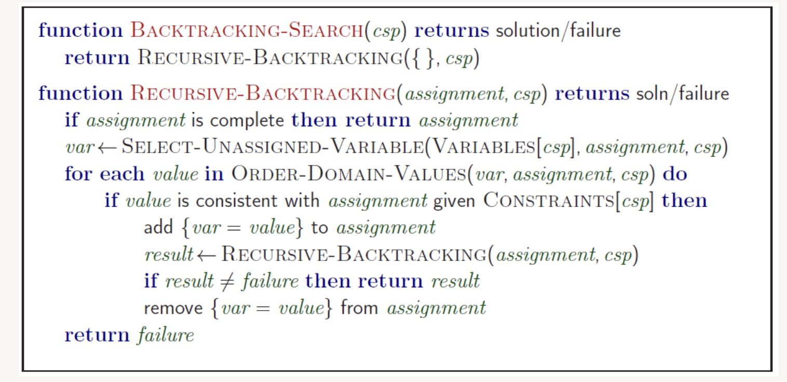
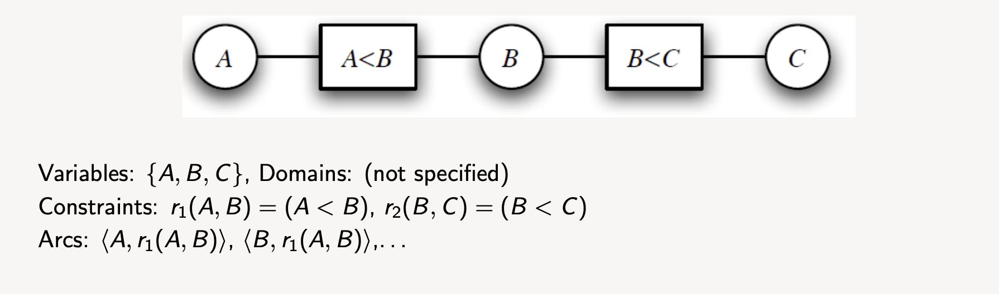
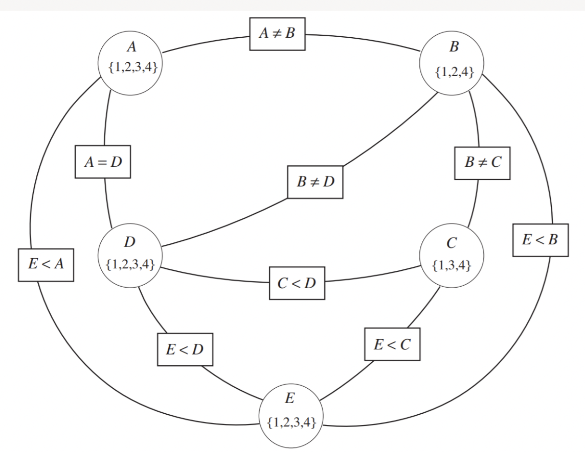
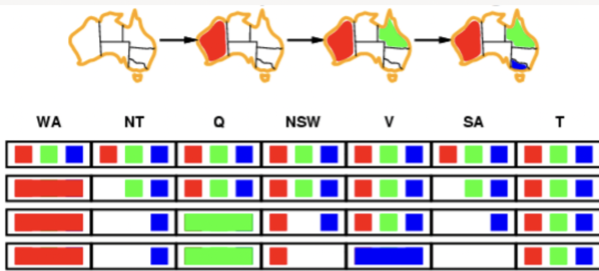
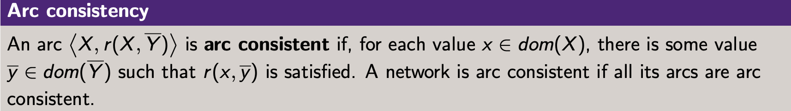
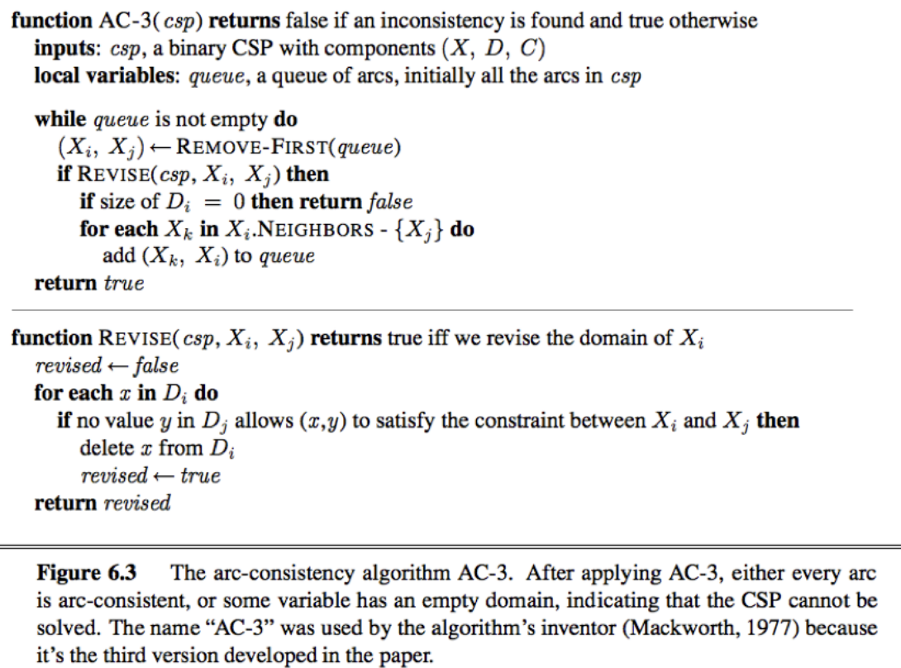

## Module 2

### Constraint Satisfaction Problems

CSP are. subset of search problems  that have thr same assumptions about the world:
- a single agent
- deterministic actions
- fully observed state
- typically (discrete state space)

CSP are specialised to identificatio problems or to provide assignemnts to varibales:
- the goal itself is important, not the path
- all paths at same depth (for most formulation)

>**A CSP IS GIVEN BY:**
>   - A set of variables X1, X2, ... Xn
>  - A domain of values D1, D2, ... Dn, one for each variable
> - A set of constraints C1, C2, ... Cn
> - Each constraint Ci involves exactly one variable, called the scope of Ci

--- 
There are also constaint optimisation problems (COPs) where the goal is to find an assignment that optimises a cost function.
- A **solution** is an assignment of values to the varibales that minimises cost function

---
### Genrate-and-Test Algorithm

- Generate assignment space dom = domv1 x domv2 x ... x domvn (ie. cartesian product)
- Test each assignment to see if it satisfies all constraints
- d^n assignments needed to be tested for n variables with domain size d

---
### Naiveley Apply DFS to a CSP 

- States defined by the values assigned so far
- Initial state: the empty assignment {}
- Successor function: assign a value to an unassigned variable that does not conflict with current assignment
- Goal Test: The current assignment is complete, and all constraints are satisfied

*What can go wrong?*
- DFS can get stuck in dead ends

---
### Backtracking Algorithm

- Systematically explore *dom* by instantiating the variables one at a time
- Evauate each constraint predicate as soon as all its variables are bound
- Any partial assignment that violates a constraint can be abandoned immediately

**Scheduling Example:** 

---
### CSP as Graph Searching

> A CSP can be solved by graph-searching with variable-ordering and fail-on-violation

- A node is an assignment to some subset of variables
- Suppose node N is the assignment X1 = v1 ... Xk = vk
- The children of N are the assignments X1 = v1 ... Xk = vk Xk+1 = v for all v in dom(Xk+1)
- The root is the empty assignment {}
- The goal test is the same as before (total assignment that satisfies constraints)

---

### Worked example: Sudoku

> Partial Solution

---

### Consistency Algorithms: Prune the Search Space

**Idea:** Abandon the domains as much as possibel before selecting values from them

A variable is **domain consistent** (or 1-consistent) if every value in its domain satisfies the variable's unary constraints

**Ex**

---

### Constraint Network: Bipartite Graph

- There is a circle or oval node for each varibale
- There is a rectangular node for each constraint
- There is a domain of value associating with each variable node (in the circle)
- There is an arc from variable X to each constrain that involves X

**Example** *Binary* constraint network

###### Here is a nicer visualisation; Constraint Network: Scheduling Example

---

### Arc-Consistency

#### Recap: Forward Checking

> Idea:
> - Keep track of remaining legal values for unassigned variables
> - Terminate search when any variable has no legal values

*This is embedded in "vanilla" backtracking search*

#### Constraint Propagation
Fwd checking propogates information from assigned to unassigned variables, but it does not provide early detection for all failures

## Arc Consistency 

> Arc consistency is the simplest form of constraint propagation -- repeatedly enforces constraints locally

- What if arc <X, r(X, ~Y)> is not consistent?
  - Then we know that X cannot be assigned to any value in dom(X) without violating the constraint 

- All values of X in dom(X) for which there is a value in dom(Y) that satisfies the constraint are said to be arc-consistent with respect to the constraint

- If X loses a value, neighbors of X need to be rechecked
- Arc consistency detects failure earlier than fwd checking
- Can be run as a preprocessor or after each assignment (e.g. within backtracking search)

---
### AC Algorithm

- The arcs can be consistered in turn making each arc consistent
- When an arc has been made arc consistent, does it ever need ot be checked again? An arc needs to be revisited if the domain of one of the variables in the arc is reduced
- Regardless of the roder in which arcs are consistered, the algorithm terminates in a finite number of steps;we will terminate with same result: arc consistent network

> Three possible outcomes of AC-3:
> -  One domain empty: no solution
> - All domains unary: unique solution found
> - Some domains have more than one value: search required (there may or may not be a solution)
>  - Need to solve this new (usually simpler) CSP: same constraints, domains have been reduced

### Complexity of AC-3

Worst-case complexity of this procedure:
- let the max size of a variable domain be d
- let the number of constraints be e
- complexity is O(ed^3)
Some special cases are faster:
• e.g. if the constraint graph is a tree, arc consistency is O(ed)

### Finding Solns When 