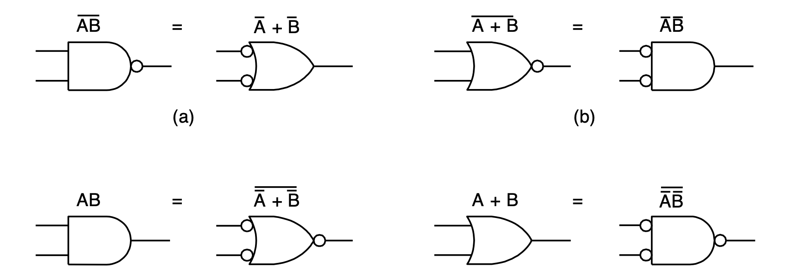
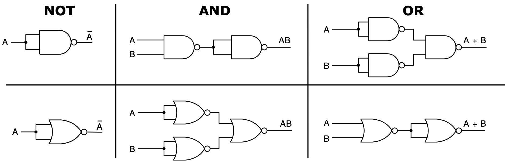
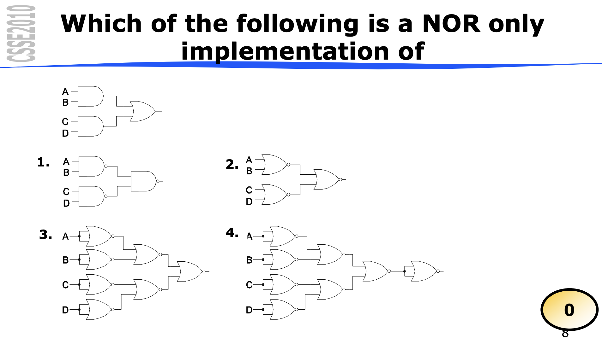
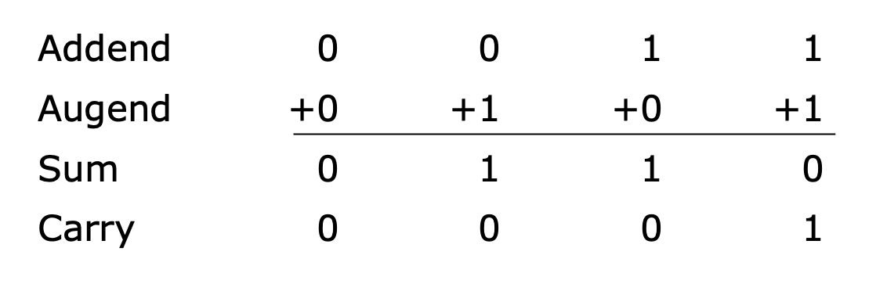

# CSSE2010 LECTURE 3

## Binary Arithmetic

---

### DeMorgan's Law / Equivalents

> Algebraically: Break the line, Change the sign

> Graphically: Bubble Pushing Method

### Equivalent Circuits

- all circuits can be constructed from NAND or NOR gates [**complete gates**]

Examples:

- Reason: Easy to construct NAND or NOR gates from transistors (a transistor is a switch)

## Poll Question

Answer is **4**

So pretty much, as shown before... to make an AND gate with just NORs with two inputs, you use 3 NOR gates.

In the given circuit, there are two AND gates, meaning there has to be minumum 6 NOR gates. 

HOWEVER, there is also an OR gate at the end of the circuit, and to construct this with a NOR gate, you need an additional 2 NOR gates (double negation).

So the answer is 6 + 2 = 8 NOR gates.

This refers to circuit 4.

---

## Binary Arithmetic

- Addition is quite simple in binary
- Subtraction is a little more complicated
- Multiplication is more complicated again
- Division is even more complicated

### Addition
- 0 + 0 = 0
- 0 + 1 = 1
- 1 + 0 = 1
- 1 + 1 = 0 (with 1 carry)

######Below is an example of binary addition:

^ The above example ignores the carry in the first column

